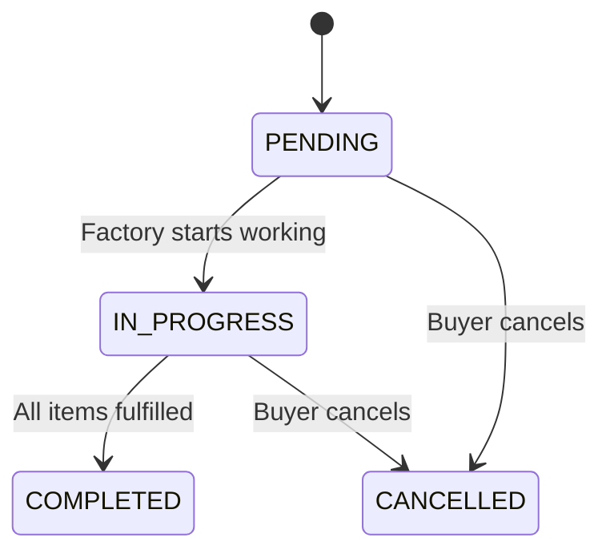
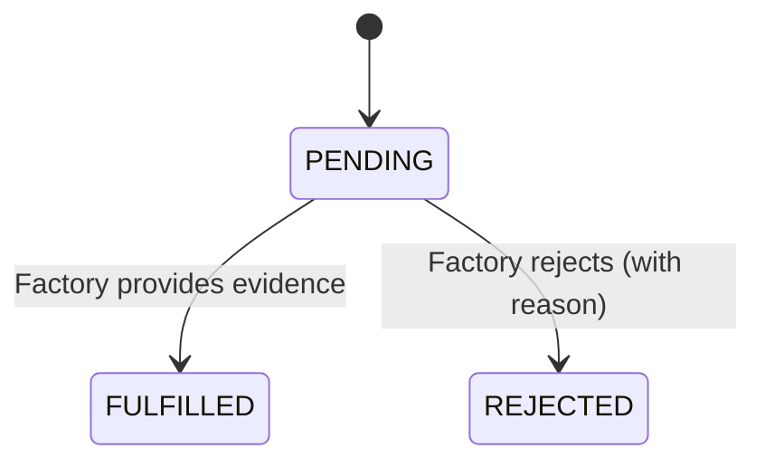

# Part B: Request Workflow Implementation

## Overview
This document outlines the implementation of the Request Workflow slice, covering the complete flow from request creation to fulfillment. The implementation uses Django REST Framework and follows RESTful API design principles.

## Implementation Details

### 1. Database Models
Already implemented in `compliance/models.py`:
- `Request`: Tracks requests from buyers to factories
- `RequestItem`: Individual items within a request
- `Evidence`: Stores evidence documents
- `EvidenceVersion`: Tracks versions of evidence documents
- `AuditLog`: Logs all significant actions

### 2. API Endpoints

#### Buyer Endpoints

**1. Create a New Request**
```http
POST /api/requests/
```
- **Authentication**: Buyer token required
- **Request Body**:
  ```json
  {
    "factory_id": "factory123",
    "title": "Q1 2025 Compliance Documents",
    "items": [
      {"doc_type": "ISO_CERTIFICATE"},
      {"doc_type": "ENVIRONMENTAL_REPORT"}
    ]
  }
  ```
- **Response**: 201 Created with request details

**2. List Requests**
```http
GET /api/requests/
```
- **Authentication**: Buyer token required
- **Response**: List of buyer's requests with current status

#### Factory Endpoints

**1. List Pending Requests**
```http
GET /api/factory/requests/pending/
```
- **Authentication**: Factory token required
- **Response**: List of pending requests for the factory

**2. Fulfill Request Item**
```http
POST /api/requests/{request_id}/items/{item_id}/fulfill/
```
- **Authentication**: Factory token required
- **Request Body**:
  ```json
  {
    "evidence_id": 123,
    "version_id": 2
  }
  ```
- **Response**: Updated request details

### 3. Workflow States

#### Request Status Flow


#### RequestItem Status Flow


### 4. Audit Logging
All significant actions are logged with:
- Timestamp
- Actor (user who performed the action)
- Action type (CREATE/UPDATE/DELETE)
- Object type and ID
- Before/after state (for updates)

### 5. Testing

#### Unit Tests
```python
class RequestWorkflowTests(TestCase):
    def setUp(self):
        self.buyer = User.objects.create_user(
            user_id='buyer123', 
            role=User.Role.BUYER
        )
        self.factory = User.objects.create_user(
            user_id='factory123',
            role=User.Role.FACTORY
        )
        
    def test_create_request(self):
        self.client.force_authenticate(user=self.buyer)
        response = self.client.post('/api/requests/', data={
            'factory_id': 'factory123',
            'title': 'Test Request',
            'items': [{'doc_type': 'ISO_CERTIFICATE'}]
        }, format='json')
        self.assertEqual(response.status_code, 201)
        
    def test_fulfill_item(self):
        # Test factory fulfilling an item
        pass
```

#### Integration Tests
1. Complete buyer workflow (create → view → check status)
2. Factory workflow (view pending → fulfill items)
3. Error cases (unauthorized access, invalid data)

### 6. Security Considerations
- **Authentication**: JWT tokens
- **Authorization**: Role-based access control
- **Input Validation**: All user input is validated
- **Data Protection**: Sensitive data masked in logs
- **Rate Limiting**: Implemented on authentication endpoints

### 7. Error Handling
Standard error responses include:
- 400 Bad Request: Invalid input data
- 401 Unauthorized: Missing or invalid token
- 403 Forbidden: Insufficient permissions
- 404 Not Found: Resource not found
- 500 Internal Server Error: Server-side error

### 8. Future Enhancements
1. Email notifications for status changes
2. File validation for evidence uploads
3. Bulk operations for request creation
4. Advanced filtering and search
5. API documentation with Swagger/OpenAPI
